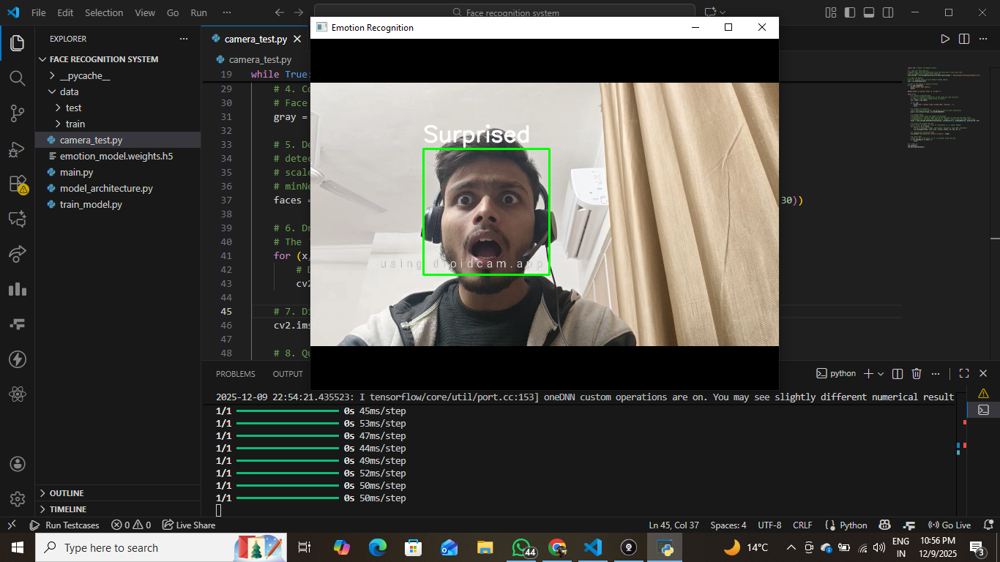
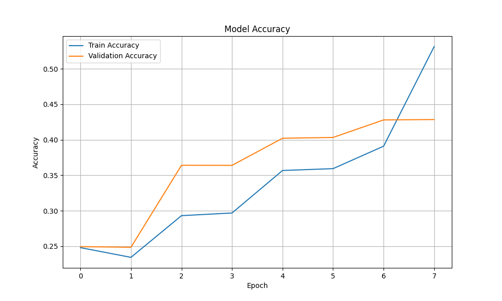

# Real-Time Face Emotion Recognition

A Computer Vision project that detects human faces in real-time and classifies their emotions using a Convolutional Neural Network (CNN).



*(A screenshot of the system detecting an emotion)*

## 📋 Table of Contents
- [Overview](#overview)
- [Tech Stack](#tech-stack)
- [How It Works](#how-it-works)
- [Installation & Usage](#installation--usage)
- [Model Performance](#model-performance)

## 🧐 Overview
This project bridges the gap between Computer Vision and Deep Learning. It captures video feed, detects faces using Haar Cascades, and passes the face region to a custom-trained CNN to predict one of 7 emotions:
* Angry, Disgusted, Fearful, Happy, Neutral, Sad, Surprised.

## 🛠 Tech Stack
* **Language:** Python 3.10+
* **Computer Vision:** OpenCV (Face Detection, Image Processing)
* **Deep Learning:** TensorFlow / Keras (CNN Architecture)
* **Data Processing:** Numpy

## 🧠 How It Works
1.  **Face Detection:** Uses `Haar Cascade Classifiers` to locate faces in the webcam feed.
2.  **Preprocessing:** Converts the face region to grayscale and resizes it to 48x48 pixels.
3.  **Inference:** The processed image is fed into a trained CNN model (`emotion_model.weights.h5`).
4.  **Output:** The model outputs a probability distribution across 7 emotions, and the highest probability is displayed on the screen.

## 🚀 Installation & Usage

1.  **Clone the repository**
    ```bash
    git clone [https://github.com/Gavnishkumar/ML-Face-expression-recognition.git](https://github.com/Gavnishkumar/ML-Face-expression-recognition.git)
    cd face-emotion-recognition
    ```

2.  **Install Dependencies**
    ```bash
    pip install opencv-python tensorflow numpy
    ```

3.  **Run the Application**
    To use the pre-trained model and start the webcam:
    ```bash
    python main.py
    ```

4.  **(Optional) Retrain the Model**
    If you want to train the model yourself:
    * Download the [FER-2013 Dataset](https://www.kaggle.com/datasets/msambare/fer2013)
    * Extract it into a `data/` folder.
    * Run the training script:
    ```bash
    python train_model.py
    ```

## 📊 Model Performance
The model was trained on the FER-2013 dataset for 50 epochs.



* **Training Accuracy:** ~57%
* **Validation Accuracy:** ~56%
*(Note: Human accuracy on this dataset is estimated around 65% due to the low resolution of images.)*

## 🤝 Contributing
Feel free to fork this repository and submit pull requests.